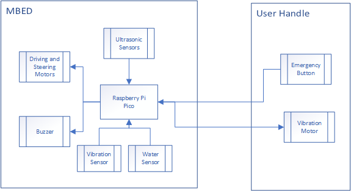
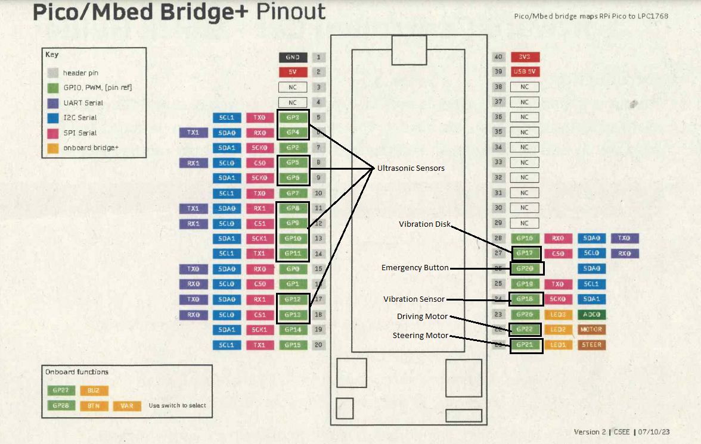
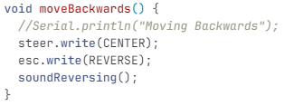
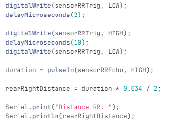
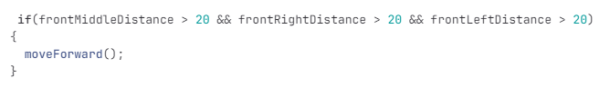
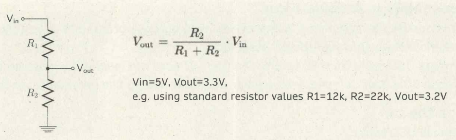
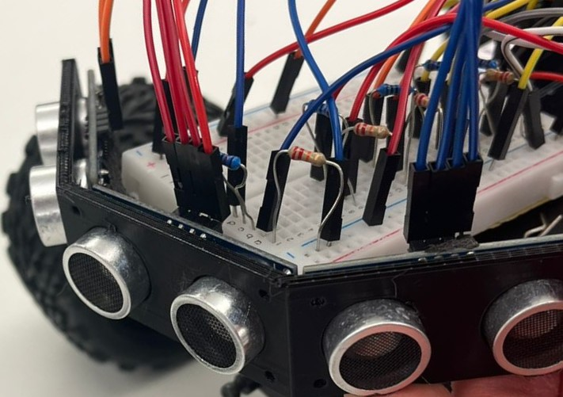
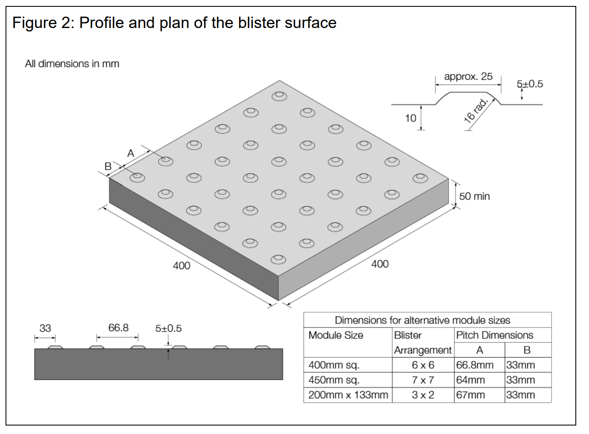
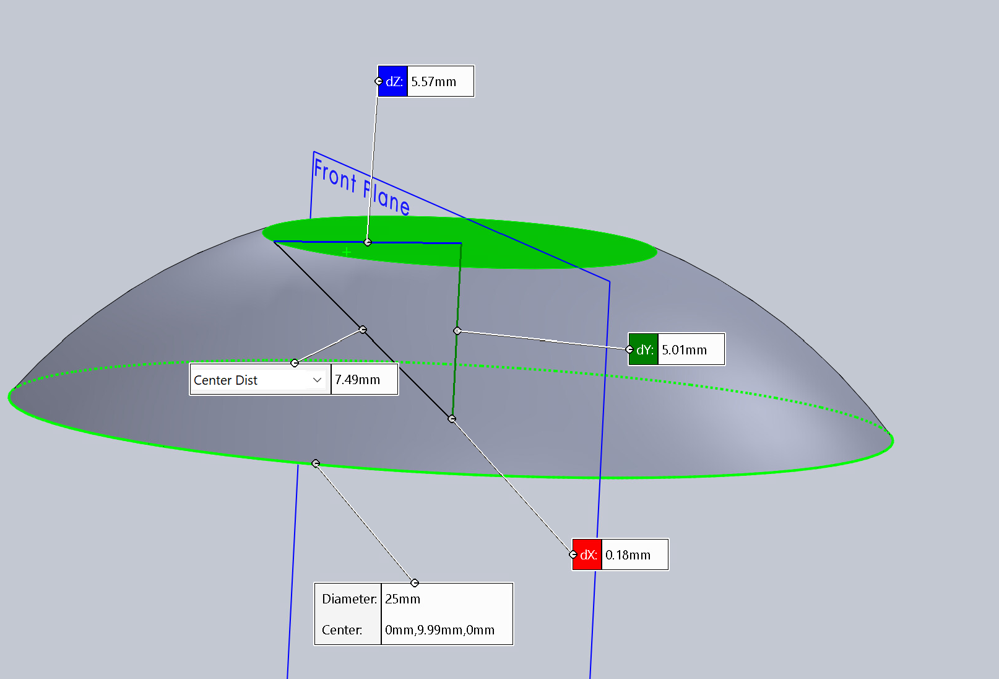

# Team Implementation Report
*This section will describe the technical details of our implementation of our project idea, M.A.X. This includes different diagrams and flowcharts to describe the architecture of the final product and how the concept has been successfully implemented.*

## Technical Diagrams
*The design of the project including the working components and the manner in which they co-operate can be described using this flowchart.*

*The Pinout of the Pico/MBED Bridge+ is as shown below:*

## Technical Description

*We used 15 pins on the Pico/MBED Bridge+. The pins were used as follows:*
- 2 pins per ultrasonic sensor, 5 sensors were needed, hence we used 10 pins for this.
- 1 pin for the vibration disc feedback to the users handle.
- 1 pin for the vibration sensor to sense for rough terrain.
- 1 pin for the implementation of the emergency button.
- 2 pins for controlling the car motors, where one is for steering and the other for driving.

*These pins were used in the layout as shown in the Technical Diagrams section.*

### Obstacle avoidance:
*The code has been made very modular to allow for further iterations of code to be developed. For instance this snippet of code:*

 

*This code has been simplified to the point where it is self descriptive and would be very easy to maintain or add to. This code is used to straighten the tire orientation, reverse the car and then play the reversing sound using the buzzer*

*The Utrasonic sensors are read from using the code below*

*This code sets the Trig pin high for a brief time span, and then checks the Echo pin for the duration between the sent and recieved pulse, and then this duration value is scaled to find the distance from the sensor.*

*Most importantly the car acts depending on the recorded distance readings for each sensor using if statements as shown in this code snippet:*

*Commenting the code well has also been used to make it easy for future developers to work on the project*

*We also made use of voltage divider circuits to calibrate the readings for the ultrasonic sensors. This is a use of Kirchoffs Voltage Law. The equation for the divider circuit and a picture of the configuration is shown below:*

### Tactile pavement detection:
**Tactile blister recognition with a vibration sensor:**  
A tactile blister pavement has a pattern of blisters of a specific size and height placed in a specific pattern with a specific distance between each blister. 

The recognition software was built by testing the values recorded by the vibration sensor as the robot moves over a test-blister (equal to the British standard for blister pavements), let's call this blisterValue. We then calculated a theoretical pattern of vibration sensor-values by considering the size of the robots wheels, the speed of the motor (or number of rotations per second) and the standard distance between the blisters, let's call this distanceValue.  
If the vibration sensor detects one blisterValue followed by the distanceValue which immediately is followed by another blisterValue, it is registered as a tactile blister pavement detection, and a signal is sent to the vibration disk on the user handle. 

## Vibration Disc feedback

As part of the user experience and feedback given by the device, we opted to include a small, low powered and simple Piezo based vibration motor that vibrates when the device reports a warning or emergency state. This device is connected through wires and is secured in the handle so that the user can get haptic feedback from the device. Examples of this where it could be used include when the emergency stop button has been pressed or the device enters an emergency state and requires user intervention or; the device is currently driving on rough terrain and wishes to warn the user through vibration feedback.

## Imported Libraries 
*Servo.h was the only imported library as it was necessary for controlling the steering and driving motors. No other libraries were needed.*

## Known Issues
- The Threshold distance for the ultrasonic sensors to detect objects could be increased so that the range of the cars obstacle detection is wider, this could reduce the chance of collision.
- The emergency stop code stops supply of power to the motors, however the momentum of the car could make it so the car slightly overshoots. This can be reduced by increasing the sensor range.
