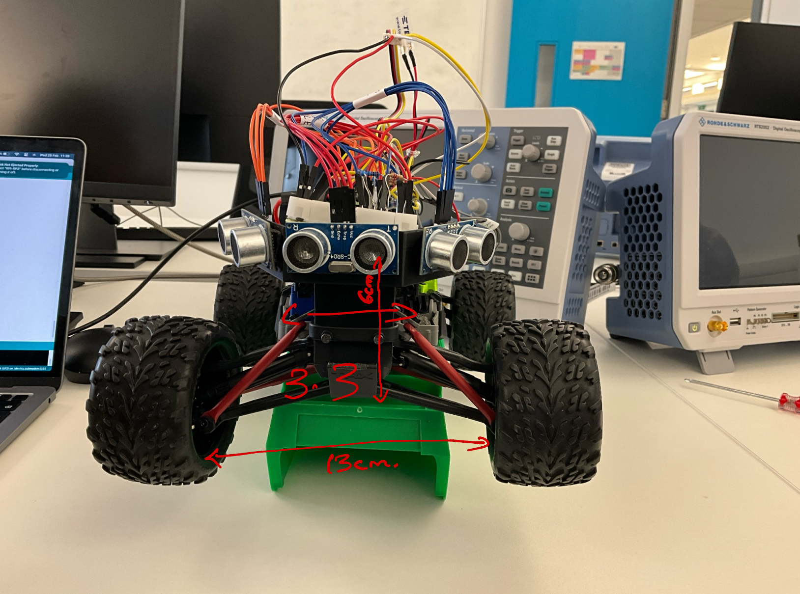
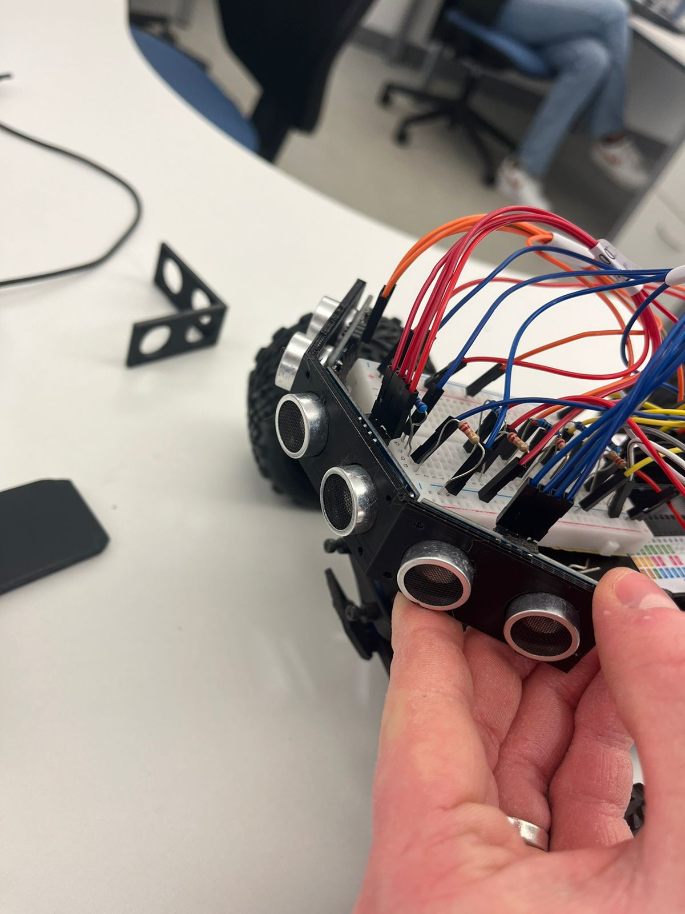
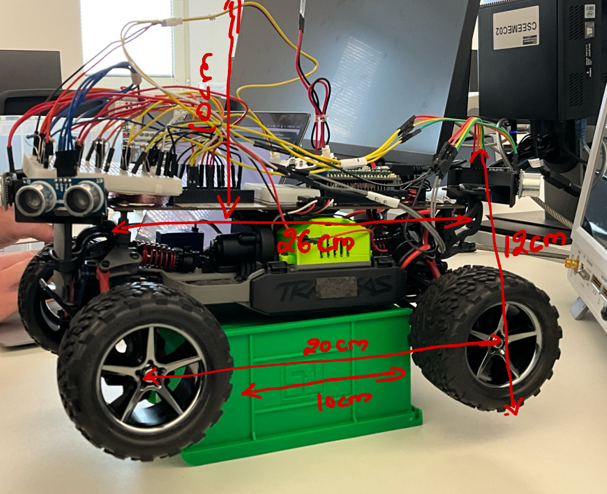
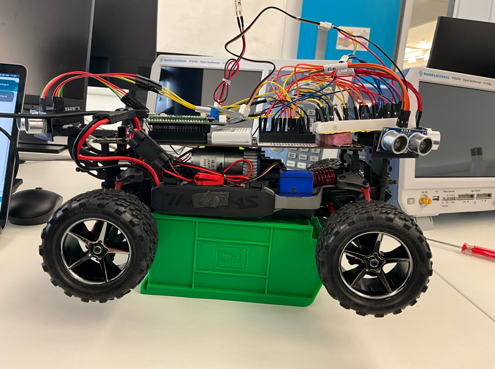
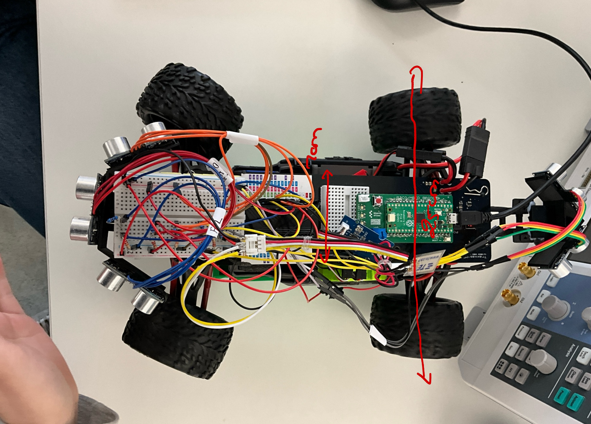

# Product Demonstration

## MAX - Mobile Accessibility eXpert
 
The Mobile Accessibility eXpert (MAX) is a cutting-edge assistive technology solution engineered to revolutionize the way visually impaired individuals navigate their surroundings. This intelligent device utilizes a Raspberry Pi Pico microcontroller, advanced sensors, intuitive tactile feedback mechanisms, and (optionally) a Bluetooth-enabled app interface to empower users with enhanced mobility, safety, and independence.

### Key Features:
* **Obstacle Avoidance:** \
The Raspberry Pi Pico microcontroller lies at the heart of MAX's navigational system. It processes data collected from five strategically placed ultrasonic sensors in real-time. The Pico's onboard software analyzes the sensor readings, enabling MAX to detect obstacles and execute smooth course corrections or safe stops as needed. This ensures a seamless and secure path for the user.
* **Water Detection:** \
Since MAX is an assistive devise for the visualy impaired, it recognizes the potential hazards posed by unexpected puddles, spills, or other water sources. MAX is equipped with a dedicated water sensor connected directly to the Raspberry Pi Pico. Upon detecting water, the Pico immediately signals the handle's vibrating disk with a distinct, urgent pattern. This proactive alert system safeguards the user from potential slips or discomfort of wet shoes etc.
* **Tactile Pavement Detection:** \
Tactile pavement plays an important role in guiding visually impaired individuals. Therefor, does MAX feature a vibration sensor specifically attuned to the textured surfaces of tactile blister pavement. The Raspberry Pi Pico continuously analyzes input from this sensor, identifying unique patterns in tactile pavement markings, such as those found at crosswalks or changes in elevation. The Pico translates this information into specific vibration patterns delivered through the handle's vibration disk, effectively conveying essential environmental information to the user.
* **User Interface:** \
MAX prioritizes a simple and intuitive user experience. Its primary interface is a comfortable handle equipped with both an emergency brake button for immediate stops and a vibrating disk, directly controlled by the Raspberry Pi Pico. The Pico generates distinct vibration patterns in the disk, corresponding to various environmental cues detected by MAX's sensors. Additionally, a Bluetooth-enabled smartphone app offers supplemental control options and allows users to customize the robot's settings for a personalized experience. 

## The robot without top cover
### The robot seen from the front, with and without sensor mounts:
The image shows the three ultrasonic sensors in the front of MAX.  

### The robot seen from two sides:
In the top of the image you can see the vibration sensors mounted vertically on the middle of the robot.

### The robot seen from above: 
The image shows, amongst other things, the circuitry connected to the microcontroller.

