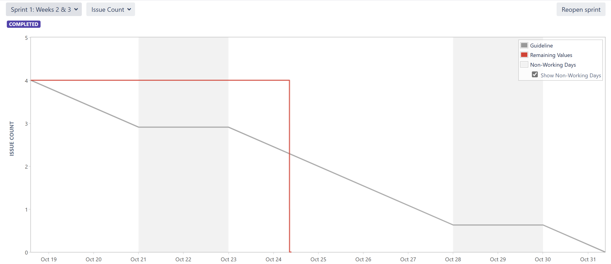
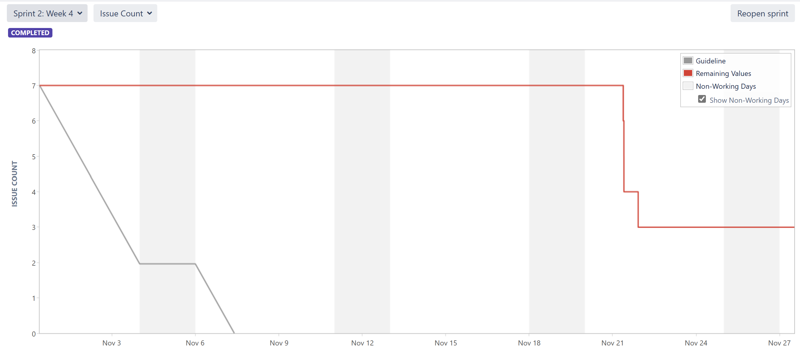
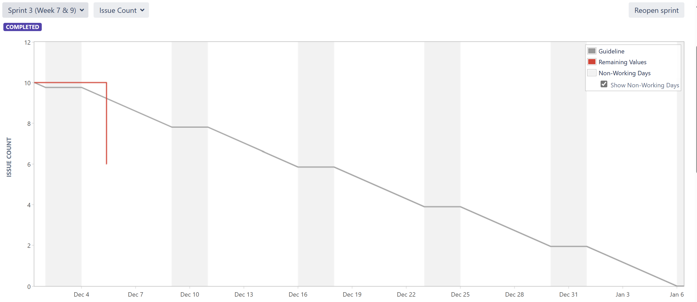
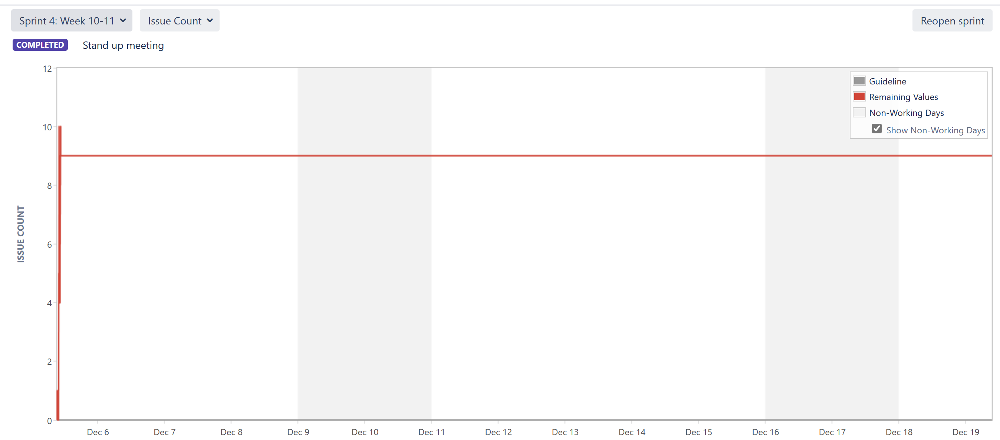
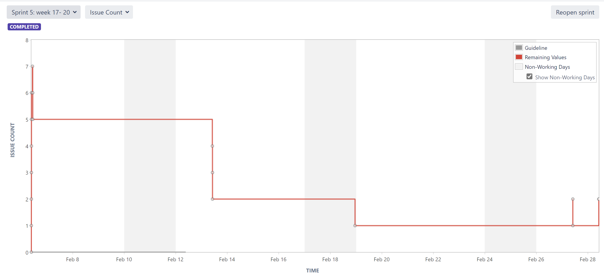
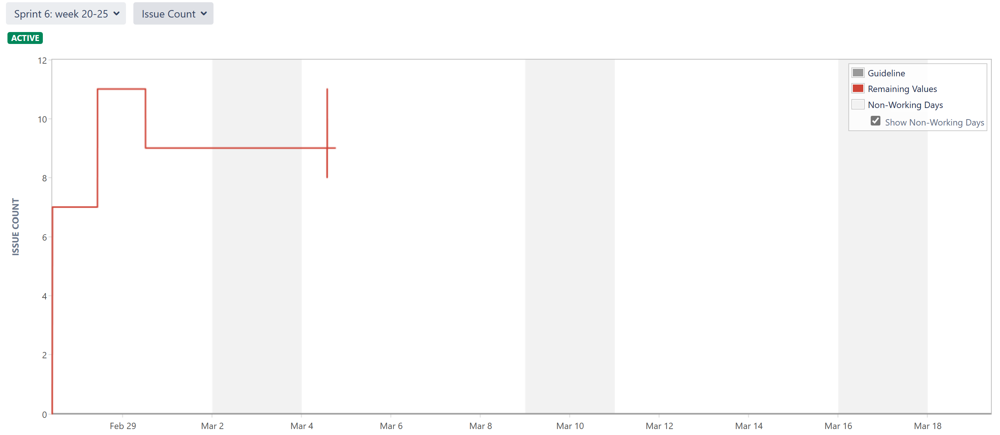
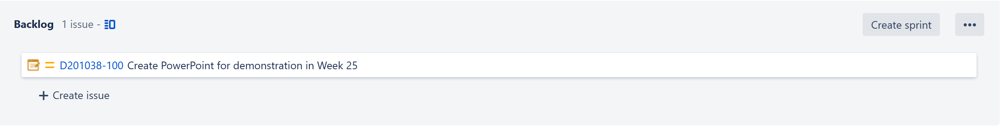

# Project Management Log
## Project Management Discussion
Our group concists of six students working on a project to develop a robot with functionalities like a guide dog for the visually impared. Our group has become a tight knitt team. We have made significant progress so far, and we are confident that we will be able to meet our deadlines.

One of the strengths of our team is our ability to work well together. We have regular meetings to discuss our progress and to troubleshoot any problems that we encounter. We are also always willing to help each other out, which has been essential to our success.

One area where we could improve is our communication. Sometimes, there is a lack of clarity about who is responsible for what, which can lead to confusion and delays. We are working on improving our communication by making the jira tasks more spesific and by talking through all the tasks together during the stand up meetings. This way we can easier bridge all the tasks together and avoid "gaps" in our progress.

Overall, we are a positive and well functioning team. We are confident we will be able to meet our deadlines if everyone finishes their tasks.

## Sprint Burndown charts

  

 

 

## Burndown-Charts Discussion

The burndown charts show how the number of completed issues develop over the timefram of a given sprint. This is an important tool for us, where we can visualise our workflow. This is very usefull when we want to improve our work as a team and predict how much work we will be able to do in future sprints. The charts is also usefull during a sprint as they show the remaining work againts the remaining time of the sprint. This makes it easier to visualise how much work we have left in relation to how close the deadline is.

Sprint 1, including week 2 and 3:
The shape of a perfect burndown would be steady, predictable decline to zero. Our chart is not ideal as it is moving straight to zero way before the sprint ended. The issues assigned in this sprint did not fill the timeframe, and as the number of issues was so small the chart is not moving steady and gradualy towards 0, but rather in a 90 degree angle. When planning and reporting our work in jira during this period we made a mistake by not activating the sprints. To obtain the burndown charts this was done at a later time, making the charts irregular. 

In the second sprint we assigned more issues than in the first sprint. The workflow was more gradual than in the first sprint, but many issues were still left at the end of the sprint. Our reported workflow is still moving in rather large chunks, where we would like it to move gradualy. By reporting our finished issues in jira as a continues prosess trough out the sprint, instead of gathering them up and reporting them in a group, we could visualise our actualy workflow better. Also this sprints chart was weakened by our incorrect use of jira. 

Sprint 3 was to include week 7 to 9The third sprint was a sprint where we planned a lot of issues for future work. Because of this the chart is not near zero by the end of the sprint, as several of the issues assigned were moved to other sprints later. 
In addition to this, there was an error with the dates for the sprint 3 and 4, leaving them to overlap eachothers timeframes.

Sprint 4 was to include week 10 to 11. Sprint 4 held a lot of the issues planned for future work, which is discussed above, leaving the issucount high at the end of the sprint.

Sprint 5 includes week 17 to 20. For sprint 5 our workflow was improved significantly. The issue count is moving more gradualy towards zero, and almost all issues are finished by the end of the sprint. There are some spikes towards the end of the sprint. This means that we encountered some work we had not initially planned for this sprint and hence assigned at a later time. But as the spikes are very slim, it shows that we were able to sort out these problems quickly.

Sprint 6 includes week 20 to 25.The sixth sprint is still active and the burndown chart is therefore an incomplete figure. From the data we have on this sprint so far, we can see that we have encountered some work during the sprint that we had not planned for from the beginning. Judging on the workflow from sprint 5 it appears to be likely that we will finish the remaining issues befor the end of the sprint. 

By examining our burndown charts all togheter we can visualise how our work as a team has developed over time. We can see from these charts that our planning has improved through out the project. In the early sprints, the charts had a lower number of issues and they were often finished before the sprint ended or after. In the later sprints we can see a higher number of issues and a gradual decrease in remaining work as we get closer to the end of the sprint. This shows that we were able to assign an appropriate and realistic amount of work for the timeframe of the given sprint. 

As these burndow charts are a visualisation of work assigned and reported done in jira, the charts' validity naturally depends on correct use. As our team did not assign the work correctly from the beginning, the early charts show some indication of our workflow, but not as accurate as for the later sprints. Nevertheless, comparing the first sprints to sprint 5 or 6 we can clearly see that our workflow has improved along with our reporting in jira. An improved reporting in jira is important in order to track our teams total progress towards the end of this project. 

## Product Backlog

