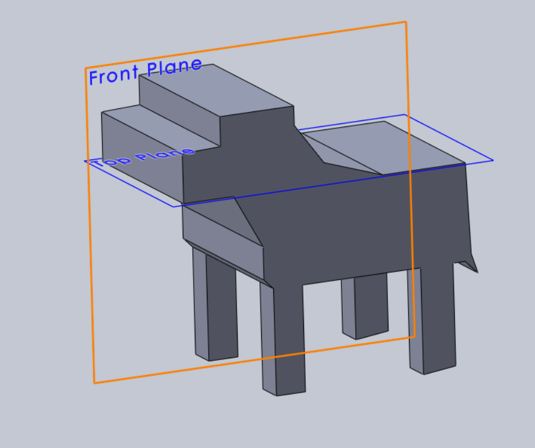

# Product Demonstration

## Introduction:
* MAX is developed inorder to help the individuals suffering from visual impairment.
* MAX ressemeble the feature of guide dog making sure its owner is safe.
* It is intended to make the most of innovative, modern advances in technology.

## Demonstrating the role of our product

Our product is a robot guide dog that can demonstrate how to navigate in the direction it needs to go autonomously. This will assist those who are visually impaired in staying safe when travelling around. If there are any obstructions in the path of the robot guide dog, it will notify its owner. Like dolphins, MAX relies on ultrasonic sensors to send and receive ultrasonic waves. It alerts the owner to the peculiarities using speakers installed on it and vibrations in the handle. Vibrating sensors are installed in the handle of the MAX to alert the user with simultaneous vibrations based on the obstructions in the surrounding area.
Our model looks like an actual dog.

https://cseejira.essex.ac.uk/browse/D201038-24

## Features

#### 1. Eco Friendly
Max uses only batteries, making it kinder to the environment. As long as the battery is charged, it will operate. Moreover, the battery is recyclable and rechargeable making it more efficient. 
 
#### 2.  Uses Ultrasonic Sensors
The most crucial component of MAX is its ultrasonic sensors, which broadcast and receive ultrasonic waves to identify obstructions in its route.
Additionally, it aids in precisely determining the distance, enabling the owner to receive a distress signal.
Controlling speed and even choosing the most straightforward path is made easier by calculating the distance and open space.

#### 3. Obstacle detection
The user benefits from obstruction detection by being protected against accidents. It makes it easier for MAX to move and navigate on its own without assistance. The user can avoid tripping by using it to locate any obstacles on the surface of the ground.By guiding the user away from any risk, this system assists them in escaping.

#### 4. Navigation
MAX will navigate it to the user-specified destination using the software. Guiding them down a road with fewer obstacles is helpful. The navigation software uses voice control to determine the destination. Real-time sensors are used by the navigation system to make adjustments based on the environment. Using a GPS system makes it easier to find road signs and even cross the street.

#### 5. User Friendly
The navigation software has been created with voice commands in mind. The user can adjust the sensitivity and speed based on the environment. The max occasionally notifies the user by describing the surroundings and communicating commands to them over speakers. Additionally, it will contain capabilities like an emergency button to warn neighbours or even family members in case of an unexpected tragedy. The guide dog is compact and portable, making it ideal for travel. Additionally, the software gathers comments and suggestions for future updates.

#### 6. Emergency Response System
As the emergency response system is connected to the internet, it can notify users in case of unexpected climatic change or even a disaster alert, potentially saving lives.
By periodically informing them, emergency situations like accidents can be prevented. Additionally, we allow the user to hold a handle that is fixed with vibrating sensors, which allows them to feel as though they are holding a guide dog and vibrates in response to an alert or the need to pass a message.

## Remarkable Features

#### 1. City Directions
MAX helps the user to navigate them safely when they are moving around a city or even in busy places.As they are unable to see what is happening, it assists them by delivering notifications so they may move safely. 

#### 2. Inside-Out Navigation
Programmed with indoor navigation capabilities, which will help users in places like public buildings, airports, and shopping centres to move carefully. It also guides them by letting them know where the enterance and exit is.

## Upgrading MAX

The original idea was to fix the sensors so they could send and receive signals; later, a moving head was added to the plan. The Max will have a stepper motor attached to a sensor, which acts as the dog's eye. The motor is programmed to detect obstacles and change the dog's motion accordingly.

https://cseejira.essex.ac.uk/browse/D201038-25

