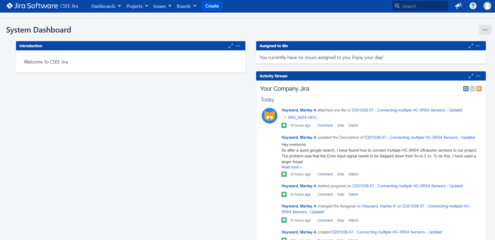
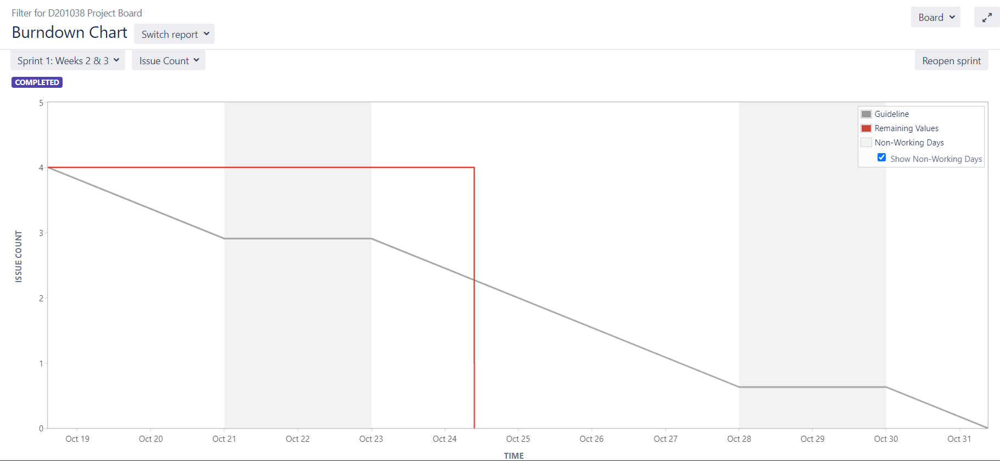
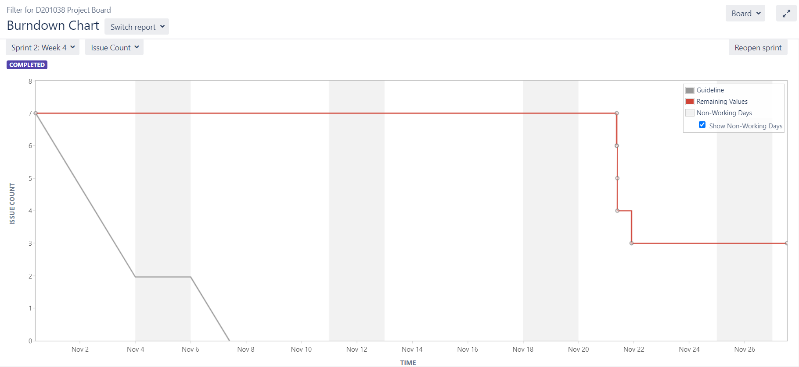
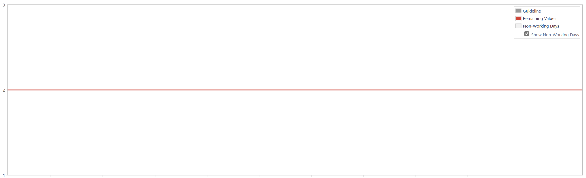
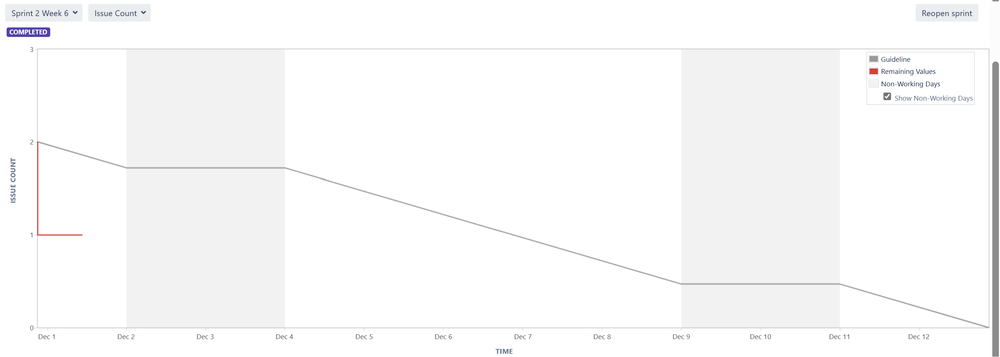
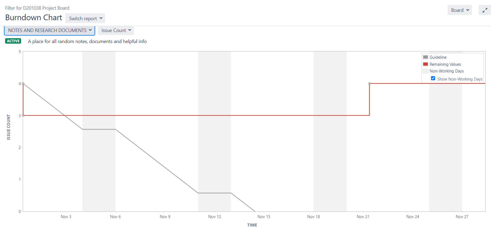
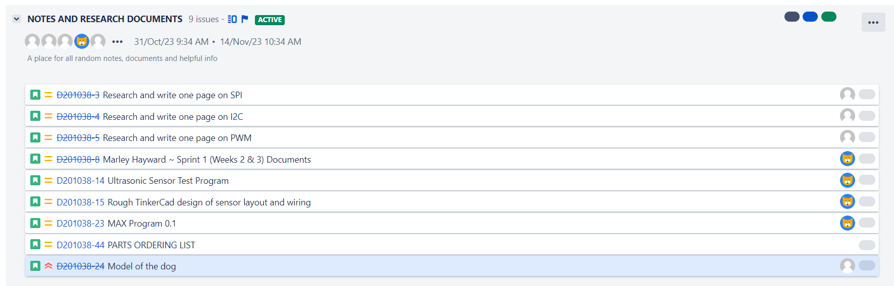
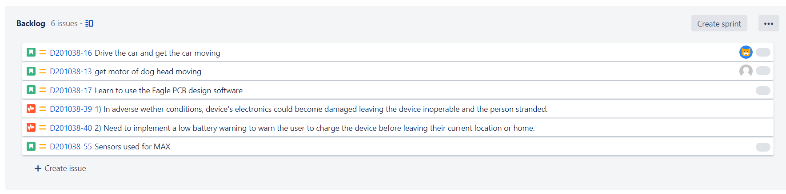

# Project Managemant Log
## Project Progress:

- Our group has fostered seamlessly, ensuring a collaborative work environment where all the team members have equal enthusiasm towards the project we are working on. 
- Various strengths of each member have been taken into consideration and the work has been equally divided accordingly. Since the beginning of the project, we have ensured that all team members were on the same page and have been updated regularly on the progress within and outside of classes also. 
- Since the initial idea of building a guide dog for the visually impaired, multiple feedback has been taken into consideration to build a project that the whole group approves. 
- From something as small as the name, to additional features, sensors and so on, we have taken everybody’s opinions and consulted our mentor as well. 
- The whole research for the project has been thoroughly done within the first few weeks and we have a solid view on what features and capabilities our guide dog should have.

## Scrum Meetings:

- Multiple scrum meetings have taken place, where we discussed what progress has been done so far, what our next target should be and what issues are affecting the project. 
- There has been a lot of trial and error in our scrum meetings which has helped us to finalise our project and helped us know what our strengths and weaknesses are.
-  Our scrum master, Marely Hayward, played a vital role in ensuring these meetings took place.
  

## Communication:

- Luckily for us, communication between the group has never been a problem as everyone is passionate and alert. 
- However, to speed up the progress, more meetings could be held so that there are regular and faster checks on the process. 
- In addition to this, adding stricter deadlines to the work distributed to the members, would ensure work to be done is not delayed.  
- Though we would not want to work in a time crunch, setting realistic deadlines would help us.

-------------------------------------------------------------------------------------------------

## Dashboard:

The CSEE JIRA Dashboard is Your dashboard is the main display you see when you log in to Jira. You can create multiple dashboards from different
projects, or multiple dashboards for one massive overview of all the work you're involved with. You can create a personal dashboard and add gadgets
to keep track of assignments and issues you're working on. Dashboards are designed to display gadgets that help you organize your projects, 
assignments, and achievements in different charts. 

## Activity Stream:
Feature that displays a chronological list of activities and updates related to issues and projects within a Jira instance.

The activity stream provides a combined view of recent changes, comments, and updates across various issues and projects. It allows users to stay knowledgable about the latest activities within the Jira instance without having to navigate to each individual issue or project separately. Users can see updates such as issue status changes, comments, attachments, and other information that is relevant.

## Sprint burndown charts:
### Burndown Chart of Sprint 1:

For the guideline, the issue of count was 4 and decreases to 2.8 from october 19th to october 21st. Then increases to 3 from october 21st to october 23rd. From october 23rd to october 28th, decreases to 0.5. From october 28th to october 30th, increases to 0.8. From october 30th to october 31st, decreases to 0. For remaining values, the issue of count was 4 from october 18th to october 24th. On october 24th, decreases to 0. 

### Burndown Chart of Sprint 2(Week 4):

For the guideline, the issue of count was 7 and decreases to 2 from november 1st to november 4th. From november 4th to november 6th, remains at 2. From november 6th to november 8th, it decreases to 0. For the remaining values, the issue of count was 7 and remains from november 1st to november 21st. Then it decreases to 4 on november 21st and then remains same until november 22nd. On november 22nd, it decreases to 2.8. Then finally remains the same from november 22nd to end of november.

### Burndown Chart of Sprint 2 (week 5):

This sprint initially had 5 tasks, and 3 of them were completed within the timeframe, yet our burndown chart indicates that we have made a mistake in our reporting to Jira.

### Burndown Chart of Sprint 2 (week 6):

Unfortunately we have only created our later sprints, we did not actually start the sprints in Jira. We have now learned from our mistakes, and will make sure to do this correct in the future. Yet, also this burndown chart shows that we have assigned and completed sprints, but not in the correct manner. 

### Burndown Chart of Notes and Research :

For the guideline, the issue of count was 4 and then decreases to 2.5 from november 1st to november 4th. Then remains at 2.5 from november 4th to november 6th. From november 6th to november 11th, decreases to 0.5. Then remains at 0.5 from november 11th to november 13th. From november 13th to november 14th, decreases to 0. For the remaining values, the issue of count was 4 and decreases to 3 on november 1st. From november 1st to november 22nd, remains at 3. Then increases to 4. From november 22nd to end of november, remains at 4.

### Burndown-Chart Discussion

The burndown chart shows the actual and estimated amount of work to be done in a sprint. The horizontal x-axis in a Burndown Chart indicates time, and the vertical y-axis indicates cards (issues). We can use the burndown chart to track the total work remaining, visualising workflow, and to help us predict if we will be able to finish the assigned work within the given time of the sprint. By tracking the remaining work throughout the iteration, we can manage the progress, and adjust ourself accordingly when necessary. For example, if the Burndown Chart shows that the we are not likely to reach the sprint goal, then we can get together and make a plan for how to solve this. It could be to put in more hours than initially estimated, or if suitable, it could be to move some tasks to the next sprint. 
The burndown chart is boards specific and will only include issues that match your board saved filter

The red graph is the graph of our work, while the grey graph is a Jira guideline which we should aim to resemble.
Our burndown-charts indicate that we assign too much work in each task, as our graph is developing in larger "chunks". It also indicates that we could benefit from reporting to Jira continuously, rather than session wise. This would hopefully help us develop a more diagonal workflow, as indicated by the guideline. The burndown-charts also show that we haven't been able to finish all the tasks in the later sprints.    
By using the report-tools of Jira more actively during our work, we can create a more even workflow, and adjust the size of our tasks to fit the time line of each sprint.  

The vertical gray areas represent non-working days and can be toggled on and off below the chart is a list of all issues for the target sprint. You can select different sprint's from the sprint drop-down. The vertical axis currently displays issue count. Use the drop-down to switch to the story points this selection is saved so the next time you view this chart. It will continue to show story points and finally in the list of issues below the report you can click an individual issue link to view the issue details.

The diagram for NOTES AND RESEARCH DOCUMENTS shows that there has been an increase in the number of issues being created which is why the red line go up on November 23. However this diagram is only random notes and other helpful information. Setting more realistic deadlines will improve the teams estimation ability for the sprints in the future. 

## Product backlog:

It's a decision making artifacts that help us to estimate refine and privatize everything we might sometime in the future want to complete. It helps to ensure the team is working on the most important and valuable feature fixing the most important box or doing other important work critical to product development. 

The backlog therefore is tremendously useful in situation when we are unable to do anything being asked so most situations are in context when even a small amount of planning will help a lot so in most context many think of this backlash to-do list and define it is exactly this way as a list of things we must deliver our product to market so why it is required when we think about the backlog as a wish list we invite flexibility and change in doing so we enable true agility and give the organization power that's necessary to win in the marketplace so let's understand how we'll create it so for creating a backlog. We have to select create issues which means it's select different stories. We have discription or summary provided. Provide epic links and you can use attachments as well. 

## Other areas:

Advanced project management tools - Advanced project management tools are specially designed to assist an individual or team in managing their projects and tasks effectively.Jira which is an  Agile project management tool that supports any agile methodology, be it scrum, kanban, or your own unique flavor. From agile boards, backlogs, roadmaps, reports, to integrations and add-ons you can plan, track, and manage all your agile software development projects from a single tool. 

Advanced use of jira - If there are other issues that relate to the one you’re working on, their  details could help add context. By linking two issues together, they will appear on each other’s issue view below the description. Linking issues doesn’t change the issues in any other way. You
can either link an existing issue or create a new issue and link it. To link an issue you open the issue view of the request, then select Link issue.

Search for an existing issue to link, or select +, Create linked issue to create a new issue. If you searched for an existing issue, choose how they relate to each other, then select Link. If you created a new linked issue, fill in the issue create form, then select Create. To link issues that
are done, search for the exact issue key, otherwise the issue won’t appear in the search. Epics are a large body of work that can be broken down into a number of smaller stories, or sometimes called “Issues” in Jira. Epics often encompass multiple teams, on multiple projects, and can 
even be tracked on multiple boards. Epics are almost always delivered over a set of sprints. Versions are points-in-time for a project. They help you schedule and organize your releases. Once a version is created and issues are assigned to it, you can use the version to filter information in various reports. 

## Continous integration tools:

 Continuous integration refers to the build and unit testing stages of the software release process. Every revision 
that is committed triggers an automated build and test. With continuous delivery, code changes are automatically built, tested, and prepared for a 
release to production. Continuous Integration and Delivery automates all the steps required to build, test and deploy your code to your production 
environment. Continuous integration automates the builds, provides feedback via code review, and automates code quality and security tests.

